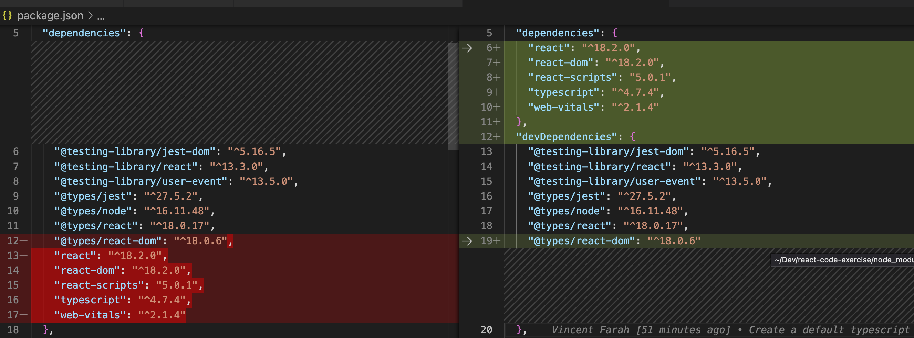
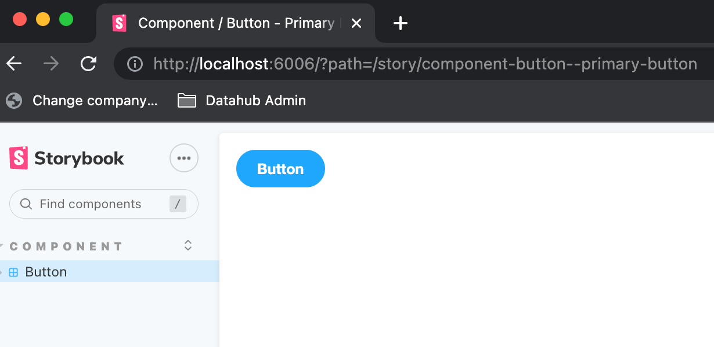
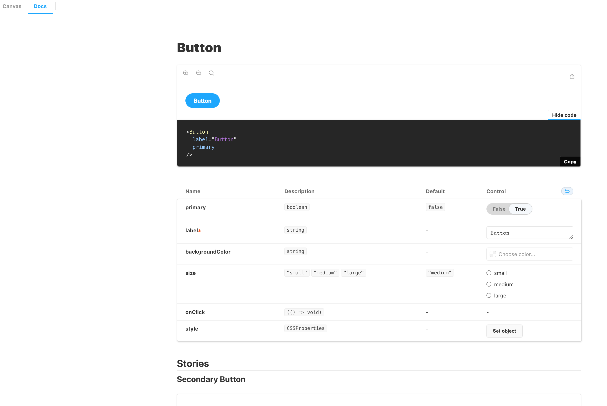
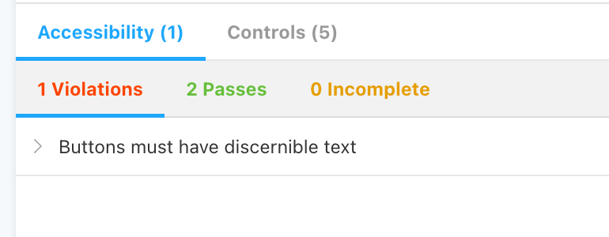
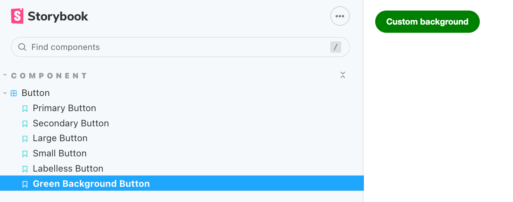
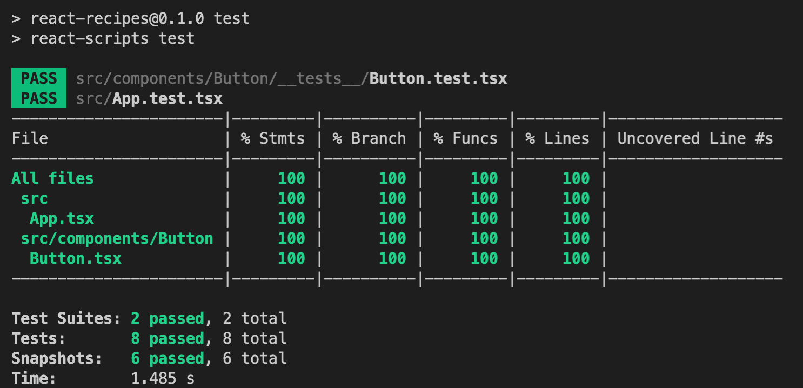

# react-code-exercise

The purpose if this is to create a quick latest template (August 2022), representing tools that make developing react applications and katas as easy as possible and allow developers to pracise on the latest versions of each space.

For the purpose of "best" practises, I will write down all the things I have included as purposeful key decisions to help me develop this library.

1. **Create [react app using typescript](https://create-react-app.dev/docs/adding-typescript/)** (see below for more details)

   - Typescript because you solve 15% of bugs at compile time, which I have prooved converting JS projects with Typescript

   - Create react app **reduces the complexity** of creating a react app, in the sense that I have worked on several bespokely generated node react applications, and it has always been a problem to migrate to the next secure version. It is good to understand how it all works under the hood, but use this for simplicity and 9/10 times, it will be more helpful in reducing pain and upgrade hell

     ```bash
     npx create-react-app react-recipes --template typescript
     npm install --save typescript @types/node @types/react @types/react-dom @types/jest
     ```

   - This comes default with **[react testing-library](https://testing-library.com/docs/react-testing-library/intro/)** and look at the [cheat sheet](https://testing-library.com/docs/react-testing-library/cheatsheet/) for testing basics. The advantage of this library is its simplicity, as well as the "*[The more your tests resemble the way your software is used, the more confidence they can give you.](https://twitter.com/kentcdodds/status/977018512689455106)"*

   - Seperate dev package from production dependencies, which is the trivial thing create app does wrong in the beginning

     

2. [**Storybook**](https://storybook.js.org/docs/ember/get-started/install) is my next must, mainly because I believe this to be an extension of my testing paradigm, and enhancement with the way I communicate with non-technical/technical people, allowing for other plugins to be added that will help to show easy configuratons changes, accessibility issues and other things. There is an issue with the documentation, or the latest storybook, which means just initialising, will not work as expected ~~npx sb init typescript~~

   ```bash
   # Note this is different to the documentation https://github.com/storybookjs/storybook/issues/13593
   npm i --save-dev webpack @storybook/react @storybook/addon-a11y @storybook/addon-actions @storybook/addon-docs @storybook/addon-storysource    
   npx storybook init typescript
   ```

   

   - Configure main.js with all the necessary addons, and see the results within the docs, 

     ```javascript
     module.exports = {
       stories: ['../src/**/*.stories.mdx', '../src/**/*.stories.@(js|jsx|ts|tsx)'],
       addons: [
         '@storybook/preset-create-react-app',
         '@storybook/addon-a11y',
         '@storybook/addon-docs',
         '@storybook/addon-controls',
       ],
       core: {
         builder: 'webpack5',
       },
     };
     
     ```

   

   

3. Add [styled components](https://styled-components.com/) a popular way of developing components using react. Feel free to use CSS or other default react ways of doing this

   ```bash
   npm i --save styled-components
   npm i --save-dev @types/styled-components       
   ```

4. Added a **button component** as an example of how I storybook test drive my code (**SB TDD**) as well as making sure storybook is working as expected. This is not unique to me, a pattern that storybook endorses and drives simalar to the way I have done it, which I found to be particulary useful when developing complex visual components. So I start with creating a component with a storybook, even before I have written a test. The only reason I deviate from classical TDD, in this case, is because I can cognitively get my head around CSS, React, Javascript easier through Storybook visual components which I found a little harder not having a visual idea. You can train yourself to do either, but as a visual person and experience with other frontend developers, I felt this was more intuituve and an easier way that developers will start doing TDD and not code after development. Then I can take those scenarios and seal them as snapshot tests and then simply write behavioural tests only (which can be done test first style). I can also install storybook testing which automatically generates the snapshots and makes sure the storybook is sealed automatically. I personally did not go with this, on this occasion, as I wanted this to be explicit about what got tested and where these tests where generated

   

5. Created a code coverage output to add to some CI pipeline to make sure a minimum standard is met. This value can be driven by the team and can be seen as a [useless metric](https://betterprogramming.pub/is-code-coverage-a-useless-metric-bc76e0fde9e), but I like to have it so I can make sure I did TDD all the happy and unhappy test paths of the component

   

6. Add `yarn` and `yarn interactive` by installing `yarn plugin import interactive-tools`

7. Added a **todo list** with a vscode extension, which has helped me to understand the best way create a list of TODO's which also help to keep a history of architectural decisions, without formalising it in this name, but helps to create a though thread for developers mobbing or individuals focusing on what has been done and what will be done

8. [Cypress](https://docs.cypress.io/guides/getting-started/installing-cypress) is next ...

# Getting Started with Create React App

This project was bootstrapped with [Create React App](https://github.com/facebook/create-react-app).

## Available Scripts

In the project directory, you can run:

### `npm start`

Runs the app in the development mode.\
Open [http://localhost:3000](http://localhost:3000) to view it in the browser.

The page will reload if you make edits.\
You will also see any lint errors in the console.

### `npm test`

Launches the test runner in the interactive watch mode.\
See the section about [running tests](https://facebook.github.io/create-react-app/docs/running-tests) for more information.

### `npm run build`

Builds the app for production to the `build` folder.\
It correctly bundles React in production mode and optimizes the build for the best performance.

The build is minified and the filenames include the hashes.\
Your app is ready to be deployed!

See the section about [deployment](https://facebook.github.io/create-react-app/docs/deployment) for more information.

### `npm run eject`

**Note: this is a one-way operation. Once you `eject`, you can’t go back!**

If you aren’t satisfied with the build tool and configuration choices, you can `eject` at any time. This command will remove the single build dependency from your project.

Instead, it will copy all the configuration files and the transitive dependencies (webpack, Babel, ESLint, etc) right into your project so you have full control over them. All of the commands except `eject` will still work, but they will point to the copied scripts so you can tweak them. At this point you’re on your own.

You don’t have to ever use `eject`. The curated feature set is suitable for small and middle deployments, and you shouldn’t feel obligated to use this feature. However we understand that this tool wouldn’t be useful if you couldn’t customize it when you are ready for it.

## Learn More

You can learn more in the [Create React App documentation](https://facebook.github.io/create-react-app/docs/getting-started).

To learn React, check out the [React documentation](https://reactjs.org/).
