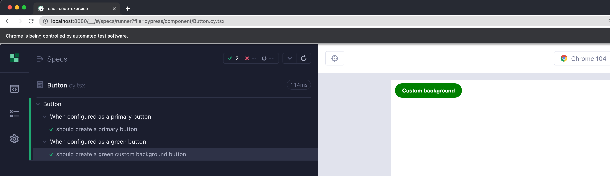

# react-code-exercise

The purpose if this is to create a quick latest template (August 2022), representing tools that make developing react applications and katas as easy as possible and allow developers to pracise on the latest versions of each space.

For the purpose of "best" practises, I will write down all the things I have included as purposeful key decisions to help me develop this starter kit with all the components/packages I have used to make this process quicker.

1. **Create [react app using typescript](https://create-react-app.dev/docs/adding-typescript/)** (see below for more details)

   - Typescript because you solve 15% of bugs at compile time, which I have prooved converting JS projects with Typescript

   - Create react app **reduces the complexity** of creating a react app, in the sense that I have worked on several bespokely generated node react applications, and it has always been a problem to migrate to the next secure version. It is good to understand how it all works under the hood, but use this for simplicity and 9/10 times, it will be more helpful in reducing pain and upgrade hell

     ```bash
     npx create-react-app react-recipes --template typescript
     npm install --save typescript @types/node @types/react @types/react-dom @types/jest
     ```

   - This comes default with **[react testing-library](https://testing-library.com/docs/react-testing-library/intro/)** and look at the [cheat sheet](https://testing-library.com/docs/react-testing-library/cheatsheet/) for testing basics. The advantage of this library is its simplicity, as well as "_[The more your tests resemble the way your software is used, the more confidence they can give you.](https://twitter.com/kentcdodds/status/977018512689455106)"_

   - Seperate dev package from production dependencies, which is the trivial issue with the way _create app_ does wrong in the beginning

     

2. [**Storybook**](https://storybook.js.org/docs/ember/get-started/install) is my next must, mainly because I believe this to be an extension of my personal testing paradigm, and enhancement with the way I communicate with non-technical/technical people, allowing for other plugins to be added that will help to show easy configuratons changes, accessibility issues and other subtle visual aids. There is an issue with the documentation, or the latest storybook, which means just initialising, will not work as expected but I was able to hand role this for you, but usually you could have initialised story book like so ~~npx sb init typescript~~

   ```bash
   # Note this is different to the documentation https://github.com/storybookjs/storybook/issues/13593
   npm i --save-dev webpack @storybook/react @storybook/addon-a11y @storybook/addon-actions @storybook/addon-docs @storybook/addon-storysource
   npx storybook init typescript
   ```

   

   - Configure main.js with all the necessary addons, and see the results within the docs,

     ```javascript
     module.exports = {
       stories: [
         '../src/**/*.stories.mdx',
         '../src/**/*.stories.@(js|jsx|ts|tsx)',
       ],
       addons: [
         '@storybook/preset-create-react-app',
         '@storybook/addon-a11y',
         '@storybook/addon-docs',
         '@storybook/addon-controls',
         '@storybook/addon-actions',
       ],
       core: {
         builder: 'webpack5',
       },
     };
     ```

   

   

3. Add [**styled components**](https://styled-components.com/) a popular way of developing components using react. Feel free to use CSS or other default react ways of doing this

   ```bash
   npm i --save styled-components
   npm i --save-dev @types/styled-components
   ```

4. Added a **button component** as an example of how I storybook test drive my code (**SB TDD**), as well as making sure storybook is working as expected. This is not unique to me, a pattern that storybook endorses and drives, which I found to be particulary useful when developing complex visual components. I usually start with creating a component within storybook, which represents starting point but necessarily a best practise test, even before I have written a test. The only reason I deviate from classical TDD, _in only this case_, is because I can cognitively get my head around CSS, React, Javascript easier through Storybook visual components, which visualises what I want to do a lot easier and so the code quality is not really reduced and the testing tools are helpful for several aspects of what needs to be solved. You can train yourself to do either, but as a visual person and experience with many frontend developers, I felt this was a more intuitive way for developers to start doing TDD or SB TDD and seemed to produce the same result I would get from traditional TDD. Then I can take those scenarios and seal them as snapshot tests, not recommended but simple for starters, and then simply write behavioural tests only (which can be done test first style). I can also install storybook testing which automatically generates the snapshots and makes sure the storybook is sealed automatically without having to do these tests manually. I personally did not go with the latter, on this occasion, as I wanted this to be explicit about what got tested and where these tests where generated.

   

5. Created a **code coverage** output to add to some CI pipeline to make sure a minimum standard is met. This value can be driven by the team and can be seen as a [_useless metric_](https://betterprogramming.pub/is-code-coverage-a-useless-metric-bc76e0fde9e), but I like to have it so I can make sure I did TDD all the happy and unhappy test paths of the component

   

6. Add `yarn` and `yarn --interactive or yarn upgrade-interactive [--latest] by installing `yarn plugin import interactive-tools` and [upgrading interactively](https://classic.yarnpkg.com/lang/en/docs/cli/upgrade-interactive/)

7. Added a **todo list** with a vscode extension, which has helped me to understand the best way create a list of TODO's which also help to keep a history of architectural decisions, without formalising this as an official [**ADR**](https://github.com/joelparkerhenderson/architecture-decision-record), but helps to create a thought thread for developers mobbing or individuals focusing on what has been done and what will be done

   

8. [Cypress](https://docs.cypress.io/guides/getting-started/installing-cypress) is escalating the power of what can be achieved. Essentially the tools help you understand how tests, component and e2e can be acheived with ease. I don't like the speed, feel the UI can be excessive, but I have seen junior and senior developers writing tests very quickly and efficiently using this framework

   

   

   - **[E2E tests](https://docs.cypress.io/guides/end-to-end-testing/writing-your-first-end-to-end-test#What-you-ll-learn)** connects to a real resource, doesn't mock anything, has real network latency and represents a slow expensive test

     

   - **[Component tests](https://docs.cypress.io/guides/component-testing/writing-your-first-component-test)** run with all the visual aids, but with the speed and feel of a unit test

     

   - I really like this [cheatsheet](https://cheatography.com/aiqbal/cheat-sheets/cypress-io/) when I am working through Cypress

   - I added the cypress testing library for developers who like react testing library

9. [**React testing library**](https://testing-library.com/docs/react-testing-library/cheatsheet/) is very useful for unit testing

10. **Error handling** with [react-error-boundary](https://www.npmjs.com/package/react-error-boundary?activeTab=dependencies) library that I feel solves this problem adequatlly in REACT and is light

11. [**Dependabot**](https://docs.github.com/en/code-security/dependabot/dependabot-version-updates/configuring-dependabot-version-updates) is a way of for GitHub dependency management tools to help you handle the security risks and maintenance requirements of incorporating any **security risks** or **vulnerabilities** that are introduced because you rely on software that is maintained outside of your project. By doing nothing to a repository you are automatically generating *tech debt*, so automate this on a CI pipeline to autimatically checkin based on a successfull build and you will reduce the need for developers to do this, until there is a breaking change, which is inevitable. Configure the yml file through GitHub and there will be a

    

    After solving the critical issues,I am left with high issues to solve when there are less pressing issues

    

12. Add [code scanning](https://github.com/vfarah-if/react-code-exercise/actions/new?category=security) to make sure to do code evaluation through a more advanced level

    

13. [**A**rchitectural **D**ecision **R**ecords](https://github.com/joelparkerhenderson/architecture-decision-record) is a document that captures an important architecture decision made along with its context and consequences. I decided to keep this lite and utiise [adr-tools](https://github.com/npryce/adr-tools) which gave me quick ways of generating this information. Feel free to do this manually but if you like a little help on the structure, install it for your operating system

14. Use [github actions](https://docs.github.com/en/actions) to run tests in different versions of node and trying to setup everything in the packages to verify all the bits of the code when pushing a branch or pulling

    a. Setup [node](https://github.com/actions/starter-workflows/blob/main/ci/node.js.yml)

    b. Setup [yarn](https://github.com/marketplace/actions/github-action-for-yarn)

    c. TODO: See it running and in action ...

15. **Next** it is up to you to practise using everything that has been configured here. Fork and branch this repo and you will have an intuitive starting point to just practise all these skills without setting up anything. Go ahead and delete what exists once you have your ideas in place and make this yours

## Environment

### Prerequisites and recomendations

- Download or install [node](https://nodejs.org/en/download/) or use [nvm](https://heynode.com/tutorial/install-nodejs-locally-nvm/)
- Download and install **[yarn](https://classic.yarnpkg.com/en/)** or convert this using npm and generate a package.lock file
- Install **[visual studio code](https://code.visualstudio.com/)** as an ide, recommended, and install all react friendly snippets, helpers, linters to make development easier and faster. Choosing frameworks is important for repetitive tasks, "don't be a plumber"

| Command                    | **Description**                                                                                                                |
| -------------------------- | ------------------------------------------------------------------------------------------------------------------------------ |
| **`yarn start`**           | Start the application                                                                                                          |
| **`yarn build`**           | Build a releaseable application                                                                                                |
| **`yarn test`**            | Unit tests for the application                                                                                                 |
| **`yarn install`**         | Install the packages found within the yarn lock file                                                                           |
| **`yarn storybook`**       | Start story book to visualise component scenarios                                                                              |
| **`yarn build-storybook`** | Build storybook to release somewhere                                                                                           |
| **`yarn coverage`**        | Run unit test coverage                                                                                                         |
| **`yarn e2e`**             | Run e2e tests in headless mode for a CI pipepline                                                                              |
| **`yarn e2e:watch`**       | Run e2e tests in watch mode with ui to filter and develop Cypress tests                                                        |
| **`yarn component`**       | Run Cypress unit/component tests as an alternative to the default jest tests as a more visual test framework for a CI pipeline |
| **`yarn component:watch`** | Run Cypress unit/component test in developer mode                                                                              |
|                            |                                                                                                                                |

# Getting Started with Create React App

This project was bootstrapped with [Create React App](https://github.com/facebook/create-react-app).

## Available Scripts

In the project directory, you can run:

### `npm start`

Runs the app in the development mode.\
Open [http://localhost:3000](http://localhost:3000) to view it in the browser.

The page will reload if you make edits.\
You will also see any lint errors in the console.

### `npm test`

Launches the test runner in the interactive watch mode.\
See the section about [running tests](https://facebook.github.io/create-react-app/docs/running-tests) for more information.

### `npm run build`

Builds the app for production to the `build` folder.\
It correctly bundles React in production mode and optimizes the build for the best performance.

The build is minified and the filenames include the hashes.\
Your app is ready to be deployed!

See the section about [deployment](https://facebook.github.io/create-react-app/docs/deployment) for more information.

### `npm run eject`

**Note: this is a one-way operation. Once you `eject`, you can’t go back!**

If you aren’t satisfied with the build tool and configuration choices, you can `eject` at any time. This command will remove the single build dependency from your project.

Instead, it will copy all the configuration files and the transitive dependencies (webpack, Babel, ESLint, etc) right into your project so you have full control over them. All of the commands except `eject` will still work, but they will point to the copied scripts so you can tweak them. At this point you’re on your own.

You don’t have to ever use `eject`. The curated feature set is suitable for small and middle deployments, and you shouldn’t feel obligated to use this feature. However we understand that this tool wouldn’t be useful if you couldn’t customize it when you are ready for it.

## Learn More

You can learn more in the [Create React App documentation](https://facebook.github.io/create-react-app/docs/getting-started).

To learn React, check out the [React documentation](https://reactjs.org/).
